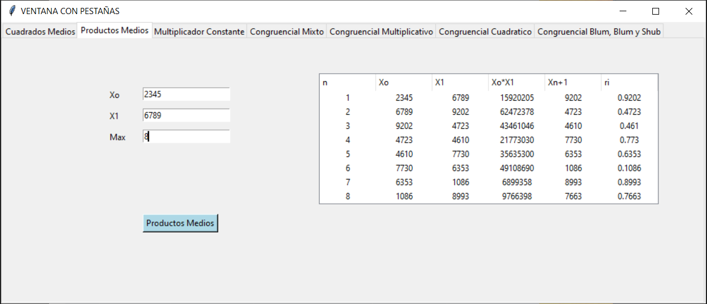

# pseudorandom_numbers

This is a small application that is used to generate pseudorandom numbers, the following types of numbers can be created:

## Non-Congruential Generator
- mean squares algorithm
- average products algorithm
- constant multiplier algorithm

## Congruential Generator
- mixed congruential generator
- multiplicative congruential generator decimal system
- multiplicative congruential generator binary system
- quadratic congruential generator
- blum blum shub congruential generator

to run the program it is necessary to install the libraries inside the requirements.txt

When the application opens, it will have a navbar where you can change between the different types of generators that the program has.

When selecting one, it will ask you for the necessary data, you enter it and it will show you the table with the result

